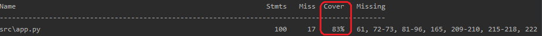

This service is programmed with Python 3.6 Flask and other libraries listed in `requirements.txt` file.

Firstly, this assignment has done with assumption that data in `restaurants.json` file is valid (presumed to come from other services and includes only non-null values and in correct format).

For the special rule: `launch_date` must be no older than 4 months, I assume that 4 months = 120 days.

There are some functions in `app.py` which are not covered by unittest, since I do not have enough time to finnish them. This picture below displays unittest's coverage:

Unittests can be run with:
```bash
coverage run -m unittest discover test 
coverage report -m
```

To make it easier for testing the service, I deployed it to Heroku via Docker. An example request is: https://oanh-wolt-test.herokuapp.com/discovery?lat=24.941244&lon=60.174

Happy testing :smile: 